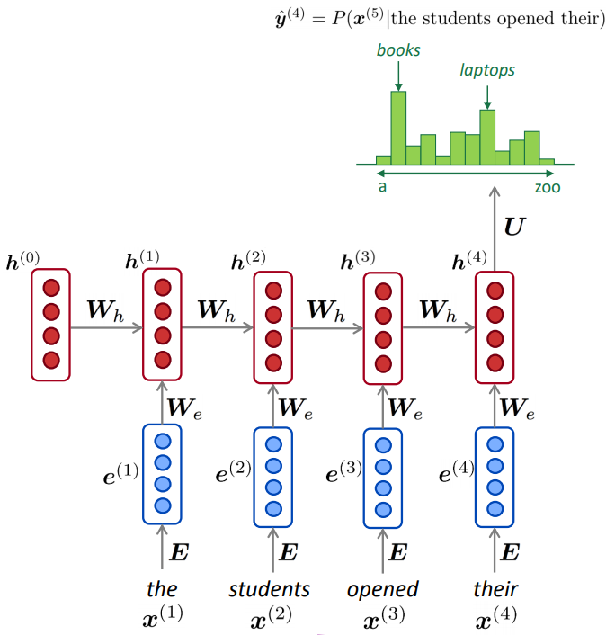

## Tutorial 1: Language Modeling with Recurrent Neural Networks

The actual tutorial (and its description) can be found in [./Language_Modeling.ipynb](./Language_Modeling.ipynb).

It is advisable to try out the this tutorial in the [Google Collaboratory
environment](https://colab.research.google.com/github/NaiveNeuron/nlp-excercises/blob/master/tutorial1-lm/Language_Modeling.ipynb)
